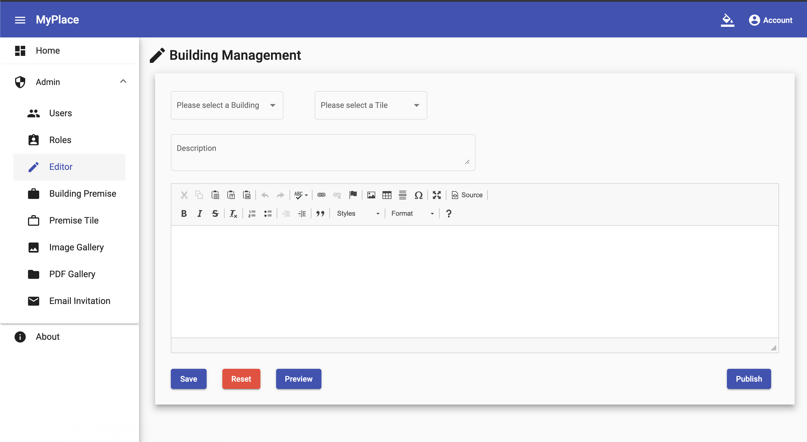
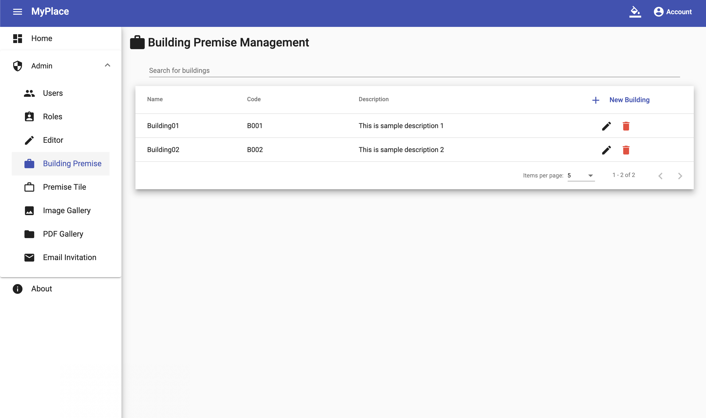
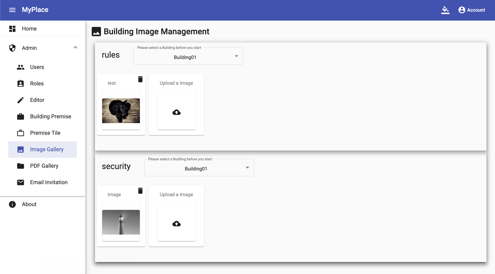

# Introduction

MyPlace is a web admin system for real estate building management, which will be used along with a mobile app.

## Tech Stack

* Angular 7
* .NET core 2.2
* Microsoft SQL Server (under docker)
* Identity Server
* SendGrid
* Material UI Angular

## Function

* User and Permission Management.
* Building, Tile, Resident Management.
* Image and PDF gallery with upload, update and delete function, followed with filter.
* Rich text editor with selecting image and pdf.
* Email invitation to selected residents.

## Demo

### 1

### 2

### 3

